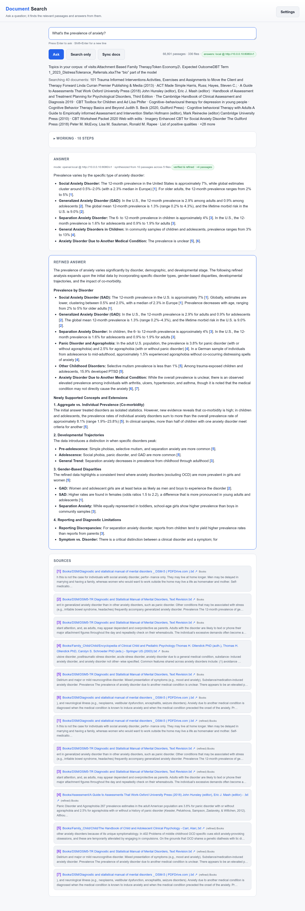

# Mini RAG

Mini RAG is a lightweight Retrieval-Augmented Generation system that converts a variety of documents (PDFs, Word, etc.) into a searchable text corpus. It allows you to ask questions and receive grounded, synthesized answers with citations, using adaptive refinement for complex queries.



## Quick Start


1. **Add your documents**: 
   Drop your PDFs, ebooks, specs, or notes into the `input/` folder.

2. **Install dependencies**:
   ```bash
   pip install -r requirements.txt
   ```

3. **Configure LLM**:
   Copy `.env.example` to `.env` and set your model and endpoint. Using a local LLM (e.g., via Ollama or LM Studio) is highly encouraged for better summaries and privacy.

4. **Launch**:
   ```bash
   ./start.sh
   ```
   Then open `http://127.0.0.1:5000` in your browser.

## How it works
- **`input/` → `output/`**: Everything you put in `input/` is automatically converted to markdown/text and synced to `output/` when you run `./start.sh`.
- **No Database**: The corpus is loaded into memory at startup using BM25 for fast, efficient retrieval without needing a vector database or embedding model.
- **Adaptive Retrieval**: The system adjusts the amount of context it sends to the LLM based on the question (e.g., pulling contiguous sections for "how-to" questions).
